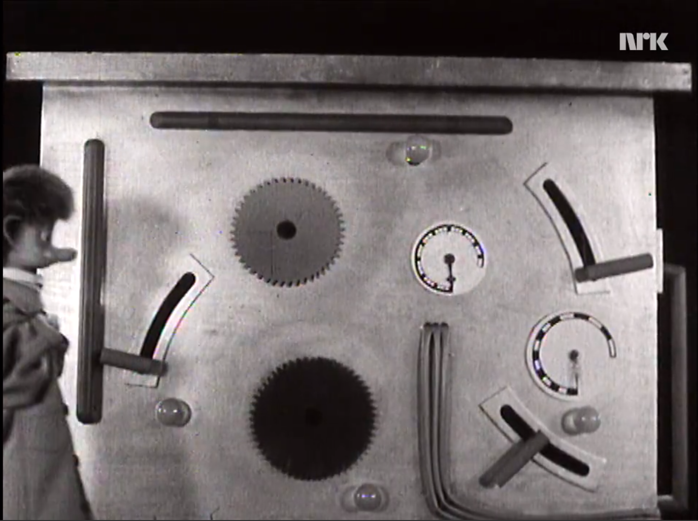

Noen grunner til å skrive tester
===============================
Dette er oversikten for deg som trenger litt ekstra motivasjon for å skrive tester!

[Video, start ca. 5:22](https://tv.nrk.no/serie/pompel-og-pilt-reparatoerene-kommer/sesong/1/episode/5/avspiller)

Det som har fungert fortsetter å fungere
----------------------------------------
Det skjer oftere enn man som utvikler kanskje liker å innrømme, du *skal bare* fikse noe et sted i koden og
ender opp med å knekke noe et heeelt annet sted. Dersom dette "helt andre stedet". Tester er ofte
det som utgjør forskjellen på å oppdage dette omtrent med en gang istedenfor i produksjon. 

Tvinger deg til å tenke på domenet / problemet
----------------------------------------------
Tester er en form for kjørbar kravspesifikasjon. En følge av dette er at det å skrive tester vil tvinge deg til å 
tenke på hva koden skal gjøre i forskjellige rare tilfeller. Om man finner ut at man ikke klarer å definere tester
er det kanskje et hint om at man må lese seg litt opp på domenet / problemet. 

Reduserer kjip og dyr manuell testing
-------------------------------------
Det å trykke seg gjennom tekstlige test-cases i et system før en prodsetting er **a)** dyrt og **b)** dritkjedelig. 
Når man skriver automatiserte tester slipper man denne dyre og kjedelige jobben, kvaliteten går opp, man kan deploye 
oftere (smidig) og man kan sove bedre om natta. Win-win-win.  

Medfører testbar kode
---------------------
Når en implementerer koden først oppdager man veldig ofte at man har gjort designvalg som gjør det vanskelig eller
praktisk umulig å skrive tester for koden. Dersom man skriver testene først, eller i det minste samtidig med koden
som skal kjøre i produksjon er det i praksis umulig å ende opp med kode som ikke lar seg teste. 

Dokumentasjon 
-------------
Dersom man gjøre en god jobb med testen (og det gjør man selvfølgelig) fungerer de også som dokumentasjon for utviklere
som kommer etter deg (eller faktisk deg selv noen uker etter at du skrev koden og har glemt alt sammen).
 